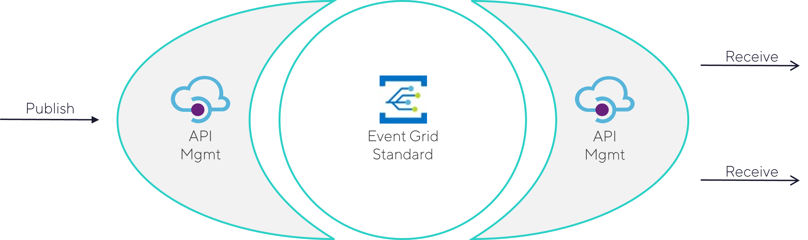
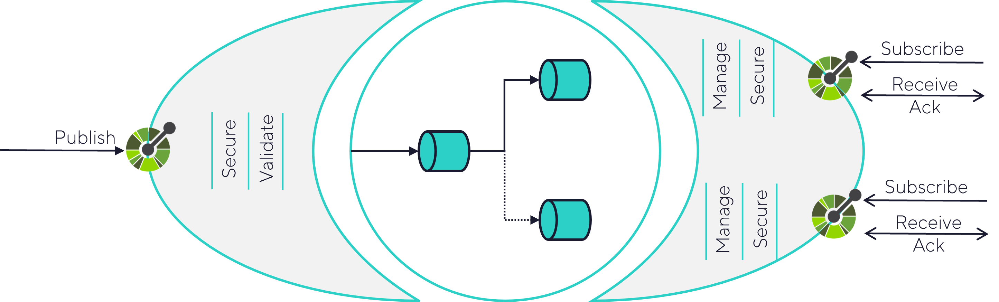

# API-based messaging

This repo contains an API-based messaging solution, that combines the power of Azure API Management and Azure Event Grid Namespaces.



## Why?

Maybe you wonder why you might want to use an API-based messaging solution.  When using native Azure messaging services, we typically face some issues.

**1. Difficult to agree on contract**

When using messaging services, there is no simple way to make agreements on how the messages that are being exchanged should look like.  This API-based messaging solution defines every message with a JSON schema, that is exposed inside the Open API Specification.  This makes it easy to exchange contracts between multiple parties involved.

**2. No validation against a contract**

In case you've found a way to agree on a contract, Azure messaging services do not validate if your messages adhere to that contract.  In this solution, Azure API Management validates every message that enters the platform and returns clear exceptions in case they don't.  In this way, we have a good quality check on the messages that enter for downstream processing.

**3. Self-service is not easy**

It is always handy that message consumers can create their own subscriptions inside the messaging service.  However, granting them access rights to the management plane gives them also control over topics and subscriptions that they don't own.  This solution provides a way to create your own subscriptions, without having access to the ones of the other consumers.

**4. Fine-grained security is quite difficult**

In case multiple message types arrives on the same topic, it's not possible to control who can receive which one.  You typically have access to all the messages that arrive on a single topic.  When you follow the design of this solution, you are able to have fine-grained security per message type.

## How does it work?

To publish and receive messages, you have clear API endpoints available that are defined in a Open API Specification.  The picture below explains the flow from a high level perspective.



**1. Publish messages**

You can publish messages via this endpoint:

```
POST <baseUrl>/message/<messageType>/publish
```

For every message type that you want to allow, a JSON schema has to be provided.  This API endpoint validates the message content against the pre-defined schema.

The security is handled by a configuration file.  This is file is described later in the *Getting started* section.  From a publishing perspective, there are two possible types of roles:

  * `publish_*`: this system is allowed to publish any message type
  * `publish_<messageType>`: this system is allowed to publish this particular message type

**2. Route messages**

Routing is done based on the message type.  The Event Grid Namespace topic subscriptions contain message type filters.

Event Grid Namespaces expect that messages adhere to the CloudEvents specification.  However, this is handled completely by Azure API Management.  It will wrap your message inside a CloudEvents envelope and will unwrap it when the message is received.

**3. Receive messages**

In orde to receive messages, you have to explicitly subscribe first on a particular message type.  This can be done through this endpoint, which will create an Event Grid topic subscription under the hood:

```
POST <baseUrl>/message/<messageType>/subscribe
```

You can undo this operation via the unsubscribe endpoint:

```
POST <baseUrl>/message/<messageType>/unsubscribe
```

In case you want to list all your active subscriptions, use this endpoint:

```
GET <baseUrl>/subscriptions
```

Once your subscription is created, you can start receiving messages.  Therefore, you use this endpoint.  This endpoint will respond immediately when there are messages available.  In case that are no messages available, it will keep the connection open for 90 seconds, waiting for messages to arrive.

```
GET <baseUrl>/message/<messageType>/receive
```
Each received message has to be explicitly acknowledged.  This is done via this endpoint.  The messageToken that you have to pass in, is provided inside the *X-MessagingApi-MessageToken* HTTP Header of the receive operation.

```
GET <baseUrl>/message/<messageType>/acknowledge?messageToken=<messageToken>
```

The security for the receive operations is again handled by the configuration file.  From a receiving perspective, there are two possible types of roles:

  * `subscribe_*`: this system is allowed to subscribe to any message type
  * `subscribe_<messageType>`: this system is allowed to subscribe to this particular message type

## Optimizations for Logic Apps

Because Azure Logic Apps is quite popular for building integration solutions on the Azure platform, this solution includes some optimizations:

**1. Speed at an affordable cost**

We implement long polling to receive messages, so you can have rapid message receival at an affordable cost.

**2. Optimal trigger status**

In case there is no message available, we return the HTTP Status Code 202 that ensures that the Logic Apps trigger gets the *Skipped* status

**3. End-to-end monitoring**

We propagate the x-ms-client-tracking-id across Logic Apps executions, so these individual invocations can be easily grouped into a single interface from a monitoring perspective.

## Getting Started

In case you want to run this solution, you can find here the easy steps to get started:

**1. Deploy the infrastructure**

We use Bicep to deploy the infrastructure.  

```
For production use cases, we highly recommend to extend the bicep modules with additional security, because they currently only cover the bare minimum settings to get started.
````
First, fill in all the parameters values in the `01_infra/infra.bicepparam` file.

Second, you can deploy the Bicep file via Azure CLI:

```cli
az deployment group create `
    --resource-group "TODO" `
    --template-file ./01_infra/infra.bicep `
    --parameters ./01_infra/infra.bicepparam
```

**2. Configure the security config file**

By default, we take Microsoft Entra ID as the default security mechanism and abuse a little bit the Azure Resource Manager resource to authenticate against.  This avoids that you need to create new app registrations, just to try this out.

In case you want to use your own identity provider, we recommend to update the following named values inside the `03_api/api.bicep` file

* 'messaging-api-default-openid-config-url' : 'https://login.microsoftonline.com/${tenant().tenantId}/v2.0/.well-known/openid-configuration'
* 'messaging-api-default-audience' : environment().resourceManager
* 'messaging-api-default-issuer' : 'https://sts.windows.net/${tenant().tenantId}/'

This security config file contains the roles that each system has.  It's an array of objects that hold this information:
* **id**: technical id of the system
* **name**: functional name of the system
* **subjects**: an array of OAuth2 subjects that together represent a single system
* **roles**: an array of roles this particular system has.  Mulitple options exist:
  * `publish_*`: this system is allowed to publish any message type
  * `publish_<messageType>`: this system is allowed to publish this particular message type
  * `subscribe_*`: this system is allowed to subscribe to any message type
  * `subscribe_<messageType>`: this system is allowed to subscribe to this particular message type

An example of this config file is shown here.

```json
[
    {
        "id": "system1",
        "name": "messaging-api-sender-and-receiver",
        "subjects": [
            "a58836cb-57c1-40ac-92cc-e74b1326f858", 
            "20c59a12-441c-4444-92ee-8b017e4f06ff",
            "dcc9144d-609c-4a30-b4e9-eed7e609398d"
        ],
        "roles": [
            "publish_*",
            "subscribe_*"
        ]
    },
    {
        "id": "system2",
        "name": "messaging-api-simulation-client",
        "subjects": [
            "41f64145-3680-45c9-be51-f6396ff6d39f"
        ],
        "roles": [
            "publish_customer.onboarded.v1",
            "subscribe_*"
        ]
    }
]
```

Upload this file in the storage account, inside a container named `config` and a file named `rbac.json`.

**3. Configure the JSON schemas**

Define the JSON schemas for every message type that you want to exchange.  There are already some dummy schemas available in the `02_sample/schemas` folder.

The schemas that you want to deploy, have to be explicitly added in the `03_api/api.bicep` file.

```
// Configure Message Schemas
var messageTypes = [
  {
    name: 'header.v1'
    content: loadJsonContent('../02_sample/schemas/common/header.v1.json')
    publishAsOperation: false
  }
  {
    name: 'customer.onboarded.v1'
    content: loadJsonContent('../02_sample/schemas/events/customer.onboarded.v1.json')
    publishAsOperation: true
  }
  {
    name: 'invoice.booked.v1'
    content: loadJsonContent('../02_sample/schemas/events/invoice.booked.v1.json')
    publishAsOperation: true
  }
  {
    name: 'project.won.v1'
    content: loadJsonContent('../02_sample/schemas/events/project.won.v1.json')
    publishAsOperation: true
  }
]
```

**4. Deploy the Messaging API**

First, fill in all the parameters values in the `03_api/api.bicepparam` file.

Second, you can deploy the Bicep file via Azure CLI:

```cli
az deployment group create `
    --resource-group "TODO" `
    --template-file ./03_api/api.bicep `
    --parameters ./03_api/api.bicepparam
```

**5. Authenticate your clients**

When using the default IDP, your clients can use the following token endpoint, with `https://management.azure.com/.default` as the scope:

```
https://login.microsoftonline.com/<tenantId>/oauth2/v2.0/token
```

## Roadmap

This is just one of my side projects, so no commitment at all on this roadmap.  However, here's a list of features that I would like to add some time:

* Email notifications for deadletter messages
* An API to retrieve deadletter messages
* The option to configure push delivery
* Support for Azure Service Bus